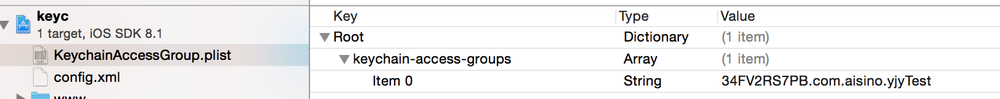

/*
Title: keychain
Description: iOS keychain plugin
*/

Keychain Plugin
=====================================

# 安装

cordova plugin add aisino-plugin-keychainutils

#设置keychain

	window.Keychain.setForKey(onSuccess, onError, key, value, accessgroup);

- __onSuccess__: 设置成功回调函数。 _(Function)_

- __onError__: 设置失败回调函数。 返回一个字符串说明失败原因。_(Function)_

- __key__: 写入keychain用于区别其他的键值名称。 _(String)_

- __value__: 写入keychain需要加密的内容。 _(String)_

- __accessgroup__: appID标示符，由Prefix和ID组成，格式Prefix.ID,其中Prefix是创建appID时开发者网站生成的10位字符串，ID是创建appID时用户自定义的bundle ID，模拟器情况下可以设置为空（null）。 _(String)_

## 支持平台
- iOS

### 示例
    var key = 'DEMO_KEY';
    var value = 'HELLO';

    window.Keychain.setForKey(this.onSuccess, this.onError, key, value,"34FV2RS7PB.com.aisino.yjyTest");

    // callbacks
    onSuccess: function(msg) {
        alert("success"+msg);
     },

    onError: function(msg) {
        alert("error"+msg);
    }

#读取keychain

	window.Keychain.getForKey(onSuccess, onError, key, accessgroup);

- __onSuccess__: 设置成功回调函数。 _(Function)_

- __onError__: 设置失败回调函数。 返回一个字符串说明失败原因。_(Function)_

- __key__: 写入keychain用于区别其他的键值名称。 _(String)_

- __accessgroup__: appID标示符，由Prefix和ID组成，格式Prefix.ID,其中Prefix是创建appID时开发者网站生成的10位字符串，ID是创建appID时用户自定义的bundle ID，模拟器情况下可以设置为空（null）。 _(String)_

## 支持平台
- iOS

### 示例
    var key = 'DEMO_KEY';

    window.Keychain.getForKey(this.onSuccess, this.onError, key,"34FV2RS7PB.com.aisino.yjyTest");

    // callbacks
    onSuccess: function(msg) {
        alert("success"+msg);
     },

    onError: function(msg) {
        alert("error"+msg);
    }

#删除keychain

	window.Keychain.removeForKey(onSuccess, onError, key, accessgroup);

- __onSuccess__: 设置成功回调函数。 _(Function)_

- __onError__: 设置失败回调函数。 返回一个字符串说明失败原因。_(Function)_

- __key__: 写入keychain用于区别其他的键值名称。 _(String)_

- __accessgroup__: appID标示符，由Prefix和ID组成，格式Prefix.ID,其中Prefix是创建appID时开发者网站生成的10位字符串，ID是创建appID时用户自定义的bundle ID，模拟器情况下可以设置为空（null）。 _(String)_

## 支持平台
- iOS

### 示例
    var key = 'DEMO_KEY';

    window.Keychain.removeForKey(this.onSuccess, this.onError, key,"34FV2RS7PB.com.aisino.yjyTest");

    // callbacks
    onSuccess: function(msg) {
        alert("success"+msg);
     },

    onError: function(msg) {
        alert("error"+msg);
    }

#设置权限

创建KeychainAccessGroup.plist文件在项目工程同级目录

必须包含必要字段keychain-access-groups,类型数组Array
然后添加accessGroup

accessGroup从开发者网站获得

